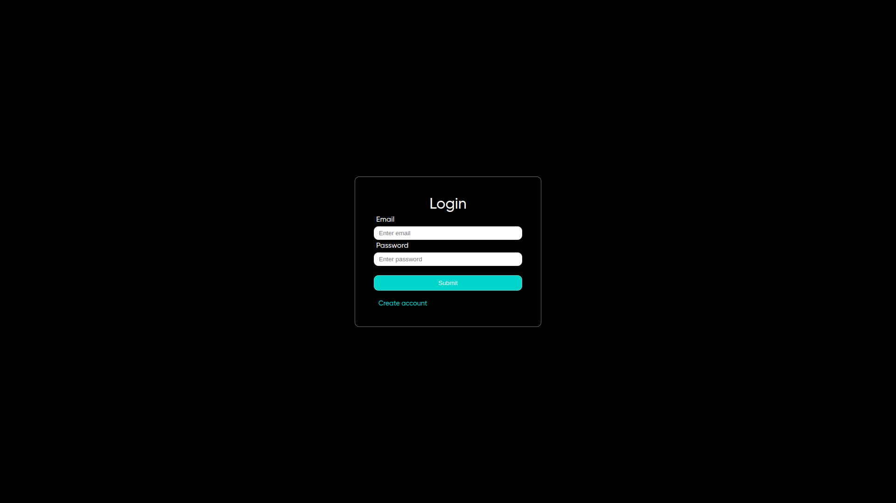
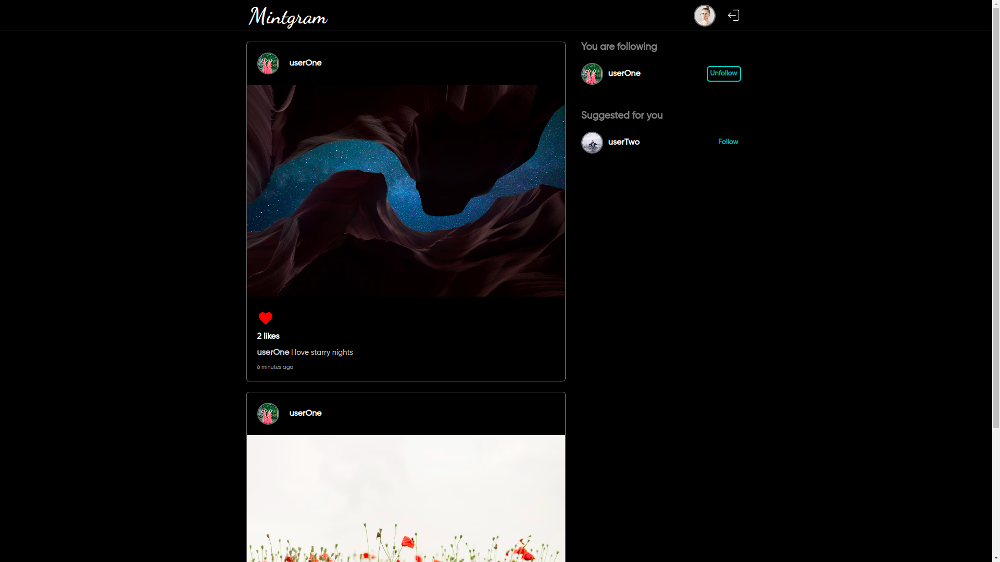
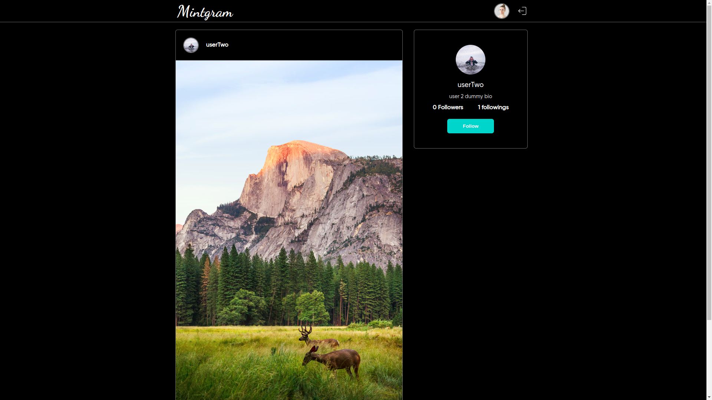
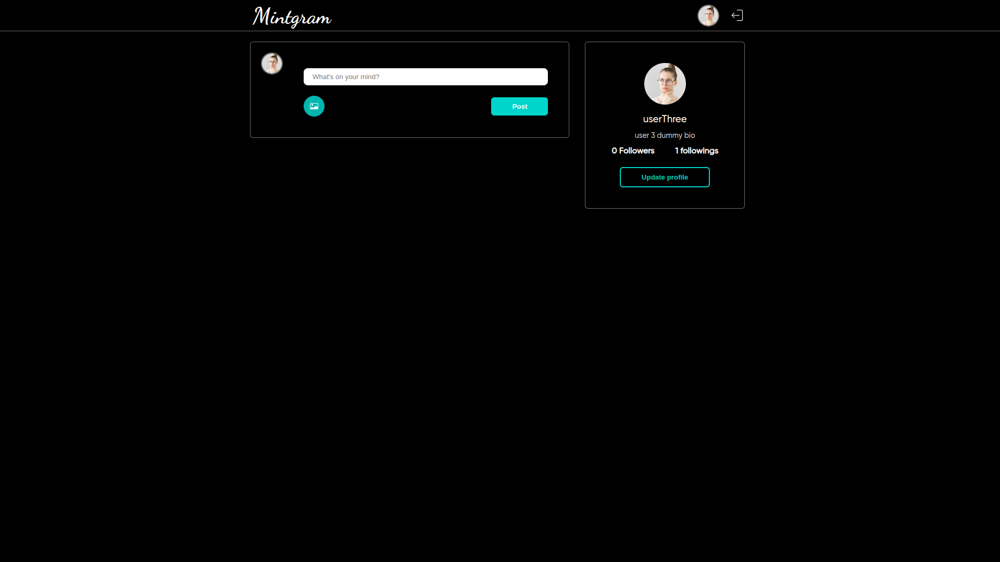
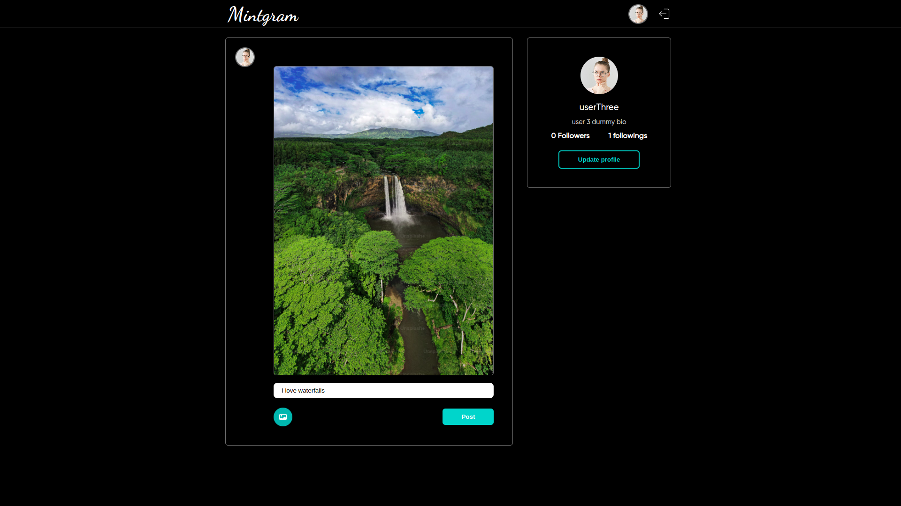
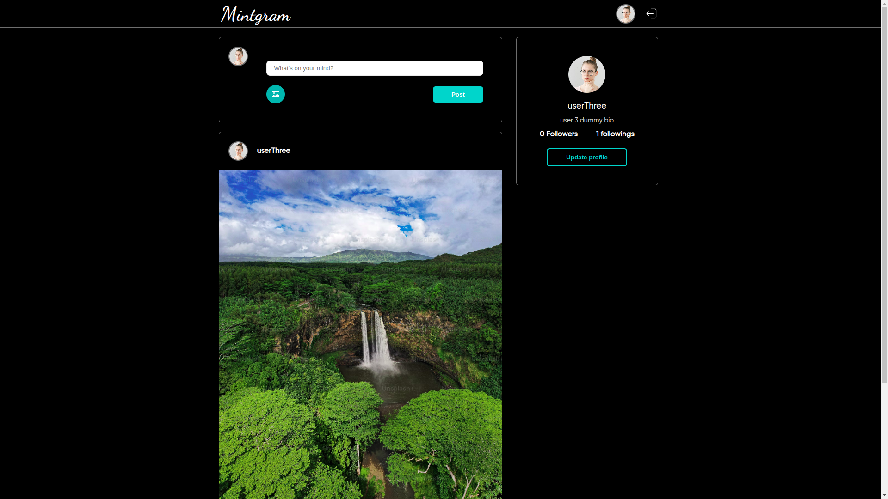
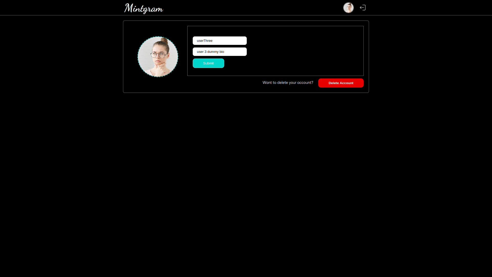

# Social Media App Client

## Description
A social media web app that is build using NodeJS and ReactJS [Backend Link](https://github.com/hadetan/Social-media-app-server). We can create an account or login into an existing account and we can logout once its logged in or signed in, we can post images with captions, get a list of users whom we are following and get recommendations of user's profile who already exists in this social media's database, we can follow other user's, we can like others and as well as our posts (if we have any), we can update our name, bio and profile picture and lastly we can delete our account if we wish to.

## Table of Contents
- [Installation](#installation)
- [Usage](#usage)
- [Project Structure](#project-structure)
- [Environment Variables](#environment-variables)
- [Features](#features)
- [Screenshots](#screenshots)
- [License](#license)
- [Contact Information](#contact-information)

## Installation
### Prerequisites
- Node.js (v14.x or later)
- npm (v6.x or later) or yarn

### Setup Instructions
```bash
# Clone the repository
git clone https://github.com/hadetan/Social-media-app-client.git

# Navigate to the project directory
cd yourproject

# Install dependencies
npm install
```

## Usage
```bash
npm start
```

## Project Structure
```bash
/public
  index.html
/src
  /assets
    /fonts
        DancingScript-VariableFont_wght.ttf
        Gilroy.ttf
    /imgs
        user.png
  /components
    /avatar
        Avatar.js
        Avatar.scss
    /createPost
        CreatePost.js
        CreatePost.scss
    /feed
        Feed.js
        Feed.scss
    /follower
        Follower.js
        Follower.scss
    /navbar
        Navbar.js
        Navbar.scss
    /post
        Post.js
        Post.scss
    /profile
        Profile.js
        Profile.scss
    /updateProfile
        UpdateProfile.js
        UpdateProfile.scss
    IfNotLoggedIn.js
    RequireUser.js
  /configs
    index.js
  /pages
    /home
        Home.js
        Home.scss
    /login
        Login.js
        Login.scss
    /signup
        Signup.js
        Signup.scss
    /redux
        /slices
            appConfigSlice.js
            feedSlice.js
            PostsSlice.js
        store.js
    /utils
        axiosClient.js
        localStorageManager.js
  App.js
  index.css
  index.js
.gitignore
LICENSE
package-lock.json
package.json
README.md
```

## Environment Variables
```bash
# Your backend URL
REACT_APP_SERVER_BASE_URL=place_here
```

## Features

- Feature 1: Log in into an existing account.
- Feature 2: Create a new account.
- Feature 3: Get posts of users we have followed on home page.
- Feature 4: Like or deslike posts of users post.
- Feature 5: Get list of users we are following.
- Feature 6: Get list of users who have created account in this app.
- Feature 7: Can visit our own profile
- Feature 8: We can post images and caption, both feilds are required.
- Feature 9: Get all the posts we have posted from our account on our profile.
- Feature 10: Update our profile with changing name, bio and our profile picture.
- Feature 11: We can delete our account from the app, in the process it will remove all the likes, followings and followers from other users profile and database while deleting our posts from database as well.
- Feature 12: We can log out from the account.
- Feature 13: We can visit other users profile to check their all posts.
- Feature 14: We can visually see how many moments ago the post was created.
- Feature 15: Other users can get recommendation of my profile and can do all the tasks your profile was able to do for their profiles and posts.
- Feature 16: Get count of followings and followers.
- Feature 17: Get count of likes on all posts.

## Screenshots










## License
This project is licensed under the MIT [License](./LICENSE) - see the LICENSE file for details.

## Contact Information
Maintainer: Aquib Ali.